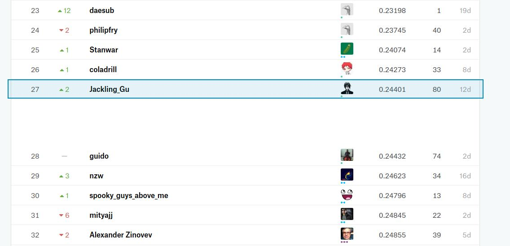
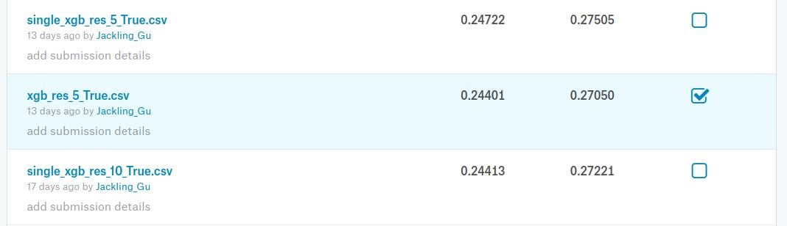

# kaggle_spooky

:scream:

link: https://www.kaggle.com/c/spooky-author-identification

## final leaderboard

https://www.kaggle.com/c/spooky-author-identification/leaderboard

my rank : 27th of 1245, ( top 3% ) :smiling_imp:





## how to get this result

```
1 git clone this repo

2 run nn_2gram_feat.ipynb

3 run nn_feat.ipynb

4 run base_xgb_nn_cv2_PL_27050.ipynb, you will get xgb_res_5_True.csv under results

```

:ghost:  done!!
